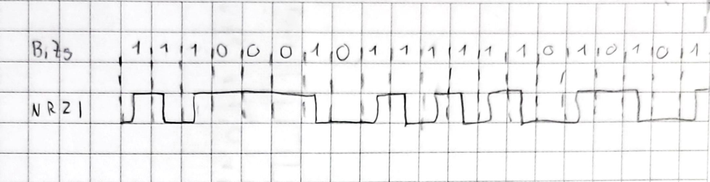
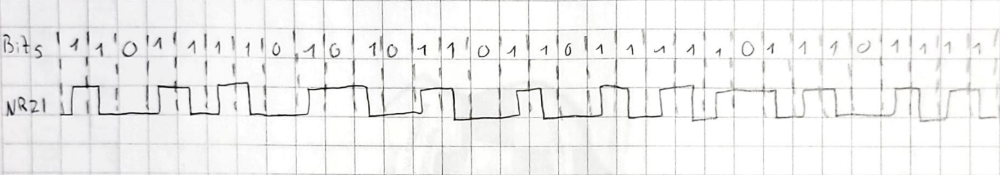
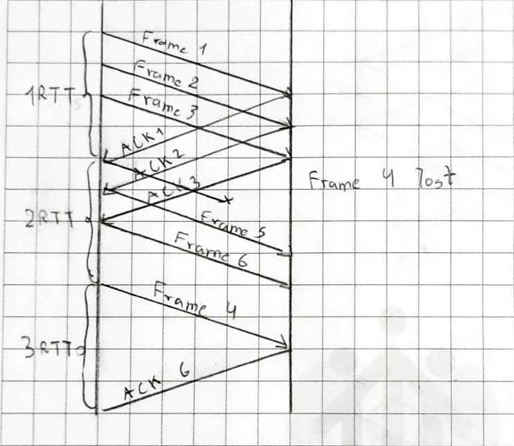
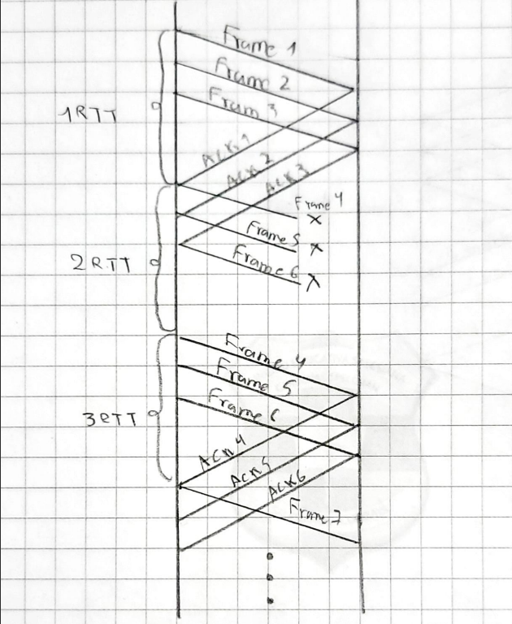

# Study Guide: Computer Networking Chapter 2

### Required reading
Sections: 2.1, 2.2, 2.4, 2.5, 2.6 and 2.7 

## Technology perspective

1. What are the different technologies used for connecting nodes in a computer network?
   
    Ethernet: Ethernet is one of the most common wired technologies used in local area networks (LANs). It employs twisted-pair or fiber optic cables to connect devices in a network. 

    Fiber Optics: Fiber optic cables use light signals to transmit data. They offer high bandwidth and are commonly used for long-distance and high-speed connections in both LANs and wide area networks.

    Coaxial Cable: Coaxial cables, like those used for cable television, were historically used for networking. They have been largely replaced by Ethernet and fiber optics in modern networks.

    Wi-Fi (802.11): Wi-Fi is a wireless technology that allows devices to connect to a network using radio waves. It's widely used for wireless LANs and provides mobility and flexibility in network connectivity.

    Satellite Communication: Satellite technology is used for long-distance network connectivity, especially in remote or geographically challenging areas.

## Encoding

1. What is encoding in the context of computer networking?

    Encoding in computer networking refers to the process of converting data from its original format into a different format for transmission over a network. It is a crucial step in networking because it ensures that data can be efficiently and accurately transmitted between devices. Encoding involves converting digital data (1s and 0s) into electrical, optical, or radio wave signals that can be transmitted over the network medium, whether it's wired or wireless. Different encoding techniques are used to represent digital data in various physical forms for transmission.

2. Explain the difference between analog and digital signals.

- Analog Signals are continuous and represent data as varying electrical voltages or continuous waves. They can take on any value within a range. Examples of analog signals include traditional landline telephone signals and vinyl records. Analog signals are susceptible to interference and degradation over long distances.

- Digital Signals are discrete and represent data using binary code, typically as 0s and 1s. They have two distinct states. Digital signals are more resistant to noise and interference compared to analog signals, making them ideal for long-distance communication. Examples of digital signals include data transmitted over the internet and digital audio files.
  
3. Explain the different types of encoding used in computer networks

- NRZ (Non-Return-to-Zero): In NRZ encoding, a high voltage represents one binary state (e.g., 1), while a low voltage represents the other (e.g., 0). It's straightforward but may suffer from signal integrity issues over long distances.

- Manchester Encoding: Manchester encoding represents binary data using transitions between high and low voltage levels within each bit period. A high-to-low transition indicates one binary state (e.g., 1), while a low-to-high transition indicates the other (e.g., 0). This encoding provides better synchronization but requires higher bandwidth.

- 4B/5B Encoding: 4B/5B encoding is often used in Ethernet networks. It encodes 4 bits of data into 5-bit code words. This increases signal transitions, aiding clock recovery and reducing the likelihood of long sequences of identical bits.

## Error Detection

1. What is error detection and why is it important in computer networks?

    Error detection is a fundamental process in computer networks that involves checking for errors or data corruption in transmitted data. It is important in network communication because errors can occur due to various factors, such as electromagnetic interference, signal attenuation, or hardware faults. Detecting errors helps ensure the integrity and reliability of data during transmission.

2. Explain the concept of parity checking for error detection.
   
    Parity checking is a simple error detection technique that adds an extra bit (parity bit) to each group of bits being transmitted. The parity bit is chosen in a way that the total number of bits with the value of '1' is always even or always odd. When data is transmitted, the sender calculates the parity bit based on the data bits and appends it to the data. At the receiver's end, the received data is checked against the received parity bit to determine if any errors have occurred.

3. Discuss the advantages and limitations of parity checking.

    Advantages:

    Simple and easy to implement.
    Detects single-bit errors.
    Suitable for detecting errors in small data units.

    Limitations:

    Limited error detection capability: Parity checking can only detect single-bit errors. It cannot detect multiple-bit errors.
    It cannot correct errors, only detect them.
    It is not suitable for high-reliability applications where more robust error detection is required.

4. Describe the process of using checksums for error detection.

    A checksum is a more advanced error detection technique than parity checking. It involves summing or applying a mathematical function to all the data bits in a message, resulting in a value known as the checksum. The sender appends the checksum to the message and sends it. At the receiver's end, the same mathematical function is applied to the received data (including the checksum), and the result is compared to the received checksum. If they match, the data is considered error-free; otherwise, an error is detected.

5. Explain Cyclic Redundancy checks. 

    CRC is a highly effective error detection technique used in many network protocols, including Ethernet. It is based on polynomial division. The sender treats the data as a binary polynomial and performs polynomial division with a pre-defined polynomial (known as the generator polynomial) to compute the CRC value. The CRC value is then appended to the data and sent.

    At the receiver's end, the received data and CRC value are divided by the same generator polynomial. If the remainder is zero, no errors are detected. If the remainder is non-zero, errors are present in the data, and appropriate error handling mechanisms are triggered.

## Reliable Transmission

1. What is reliable transmission and why is it important in computer networks?

    Reliable transmission in computer networks refers to the guarantee that data sent from a sender to a receiver arrives intact, in the correct order, and without errors or loss. It is important in computer networks because data transmission can be susceptible to various issues, such as network congestion, packet loss, errors in transmission media, and other factors that can result in data corruption or loss. 

2. Explain the concept of stop-and-wait protocol for reliable transmission.

    The stop-and-wait protocol is a simple and straightforward method for achieving reliable transmission in computer networks.

    The sender sends a data frame to the receiver.
    After sending the frame, the sender waits for an acknowledgment (ACK) from the receiver to confirm successful reception.
    If the sender receives the ACK within a specified timeout period, it considers the frame successfully transmitted and sends the next frame.
    If the sender does not receive the ACK within the timeout period or receives a negative acknowledgment (NACK), it assumes that the frame was not received correctly and retransmits the same frame.
    This process continues until all frames are successfully transmitted and acknowledged.

3. Discuss the advantages and limitations of stop-and-wait protocol.

    Advantages:

    Stop-and-wait is easy to implement and understand, making it suitable for basic network communication. Also, it guarantees reliable transmission by waiting for acknowledgments and retransmitting if necessary. And provides a basic form of flow control, ensuring that the sender does not overwhelm the receiver with data.

    Limitations:

    Stop-and-wait can be highly inefficient, especially on high-speed networks or with long propagation delays. The sender must wait for acknowledgments before sending the next frame, leading to underutilization of the network.
    Moreover the protocol's throughput is relatively low compared to more advanced protocols like sliding window, as it transmits one frame at a time. And the latency introduced by the waiting period for acknowledgments can be significant in some network scenarios.

4. Describe the process of using sliding window protocol for reliable transmission.

    The sliding window protocol is a more efficient and complex method for achieving reliable transmission in computer networks. It allows the sender to transmit multiple frames before waiting for acknowledgments.

- The sender maintains a "window" of frames that it can send without waiting for acknowledgments.
- The sender continuously sends frames within the window to the receiver.
- The receiver acknowledges the frames it receives successfully and in order.
- If the sender receives acknowledgments for frames in the window, it slides the window forward, allowing the sender to send more frames.
- If the sender does not receive acknowledgments for frames within a specified time or receives a NACK, it retransmits the unacknowledged frames.

## Ethernet and Multiple Access Networks

1. What is Ethernet and how does it work?

    Ethernet is a widely used networking technology for connecting computers and devices in local area networks (LANs). It is based on the IEEE 802.3 standard and uses a protocol called Carrier Sense Multiple Access with Collision Detection (CSMA/CD). 

     - Carrier Sense (CS): Before transmitting data, a device listens to the network to check if it's busy. If it detects another signal (carrier), it defers its transmission until the network is clear.
    - Multiple Access (MA): Multiple devices can access the network medium, but they must do so using a contention-based approach.
    - Collision Detection (CD): If two devices transmit data simultaneously and their signals collide, both devices detect the collision and stop transmitting. They then perform a "backoff" and retransmit their data after a random time interval to reduce the likelihood of another collision.

    Data in Ethernet is transmitted in discrete units called frames. Each frame contains a header with source and destination addresses, control information, the actual data payload, and a frame check sequence (FCS) for error detection.

    Ethernet uses a MAC sublayer to control access to the shared network medium (usually a coaxial cable, twisted-pair cable, or fiber optic cable). Devices on the network have unique MAC addresses that are used to identify them.

2. Explain the concept of multiple access networks.

    Multiple access networks are network architectures where multiple devices share a common communication medium or channel. The goal is to enable multiple devices to transmit and receive data without interference.

    As described above the CSMA/CD (Carrier Sense Multiple Access with Collision Detection) is used in traditional Ethernet networks to avoid collisions on shared media.

    Also the CSMA/CA (Carrier Sense Multiple Access with Collision Avoidance) is used in wireless networks like Wi-Fi. Devices listen for channel activity and defer transmissions to avoid collisions proactively.

3. Discuss the advantages and limitations of Ethernet.

    Advantages:

    Ethernet was one of the most widely used networking technologies, making it compatible with a wide range of devices and equipment. Ethernet networks can be easily scaled by adding more switches or hubs. The ethernet components are generally cost-effective and readily available. And the modern Ethernet standards support high data rates, suitable for demanding applications.

    Limitations:

    Ethernet has distance limitations depending on the physical medium used (e.g., copper or fiber). And are susceptible to collisions that can degrade performance.

4. Describe the process of collision detection in Ethernet.

    Collision detection in Ethernet involves monitoring the network for collisions during data transmission. If a collision is detected, the transmitting devices use a backoff algorithm to retransmit data after a random time delay. Collision detection is essential for shared Ethernet networks using CSMA/CD to ensure fair access to the network medium.

5. Give examples of different multiple access techniques used in computer networks.

- Ethernet (CSMA/CD)
- Wi-Fi (CSMA/CA)
- TDMA in cellular networks like GSM and 4G LTE.
- FDMA in older analog cellular networks.
- CDMA in 3G and 4G cellular networks.
- Polling-based multiple access, used in some industrial networks.

## Wireless Networks

1. What are wireless networks and how do they work?

    Wireless networks are computer networks that use wireless communication technologies to connect devices without the need for physical cables. These networks rely on electromagnetic waves, such as radio waves and microwaves, to transmit data between devices. 

    In a wireless network, devices are equipped with transmitters and receivers, often referred to as transceivers. Transmitters convert data into electromagnetic signals (e.g., radio waves), which are then sent over the airwaves. Receivers capture these signals and convert them back into data.

    In many wireless networks, access points act as intermediaries between wireless devices and the wired network infrastructure. Access points are responsible for receiving wireless signals from devices and forwarding data to the wired network or the internet.

    Wireless networks use various communication protocols and standards to ensure that devices can communicate effectively. For example, Wi-Fi uses the IEEE 802.11 family of standards, while cellular networks use protocols like GSM, 3G, 4G, and 5G.

2. Explain the concept of wireless communication channels.

    Wireless communication channels refer to the physical medium through which wireless signals travel. These channels can be classified into various types.

    Radio Waves: Radio waves are the most common medium for wireless communication, used in technologies like Wi-Fi, Bluetooth, and FM radio. They have different frequency bands.

    Microwaves: Microwaves are used for point-to-point communication over longer distances, often in microwave links. They operate in the GHz (gigahertz) frequency range.

    Satellite Signals: Satellite communication uses geostationary or low Earth orbit (LEO) satellites to relay signals between distant locations. This is common in global telecommunications and satellite television.

3. Discuss the advantages and limitations of wireless networks.

    Advantages:

    Wireless networks enable device mobility, allowing users to connect from various locations.Adding new wireless devices to a network is generally easier and more flexible than adding wired connections. And wireless technologies can provide connectivity in areas where laying cables is impractical or expensive.

    Limitations:

    Wireless signals have limited range compared to wired connections, and their strength can be affected by obstacles and interference, as example Wireless networks can suffer from interference from other devices, neighboring networks, or environmental factors. And in shared wireless networks, multiple devices compete for limited bandwidth, which can lead to congestion and slower speeds.

4. Describe the process of wireless signal propagation and interference.

    Wireless signals propagate through the air in all directions from the transmitter. The signal strength decreases with distance, following the inverse square law, meaning that the signal becomes weaker as the distance from the source increases.

    Wireless signals can take multiple paths to reach the receiver due to reflection, diffraction, and scattering. This can result in signal fading and interference.

    Interference occurs when other wireless devices or sources emit signals on the same frequency bands, causing signal degradation. Interference can be mitigated through channel allocation, frequency hopping, or signal filtering.

5. Give examples of different wireless networking technologies used in computer networks.

- Wi-Fi (IEEE 802.11): A common wireless technology for local area networking, allowing devices to connect to the internet or a LAN wirelessly.

- Bluetooth: Used for short-range wireless connections between devices like smartphones, headphones, and IoT devices.

- Cellular Networks: Technologies like 3G, 4G (LTE), and 5G provide wireless connectivity for mobile devices and internet access.

- Satellite Communication: Utilized for global connectivity, including satellite TV, GPS, and internet access in remote areas.

## Exercises

1. Show the Manchester, 4B/5B encoding, and the resulting NRZI signal, for the
following bit sequence:
1110 0101 0000 0011

    Original: 1 1 1 0 0 1 0 1 0 0 0 0 0 0 0 1 1

    Manchester: 10 10 10 01 01 10 01 10 01 01 01 01 01 01 10 10

    4B/5B: 11100 01011 11110 10101
    
    NRZI: 

2. Show the Manchester, 4B/5B encoding, and the resulting NRZI signal, for the
following bit sequence:
1101 1110 1010 1101 1011 1110 1110 1111

    Original: 1 1 0 1 1 1 1 0 1 0 1 0 1 1 0 1 1 0 1 1 1 1 1 0 1 1 1 0 1 1 1 1

    Manchester: 10 10 01 10 10 10 10 01 10 01 10 01 10 10 01 10 10 01 10 10 10 10 10 01 10 10 10 01 10 10 10 10

    4B/5B: 11011 11100 10110 11011 10111 11100 11100 11101

    NRZI: 

3. Suppose we want to transmit the message "1011 0010 0100 1011" and protect it from errors using the CRC8 polynomial x^8 + x^2 + x^1 + 1.

- Use polynomial long division to determine the message that should be transmitted.

    We take the message 1011 0010 0100 1011, append 8 zeros
    and divide by 1 0000 0111 (x^8 + x^2 + x^1 + 1). The remainder
    is 1001 0011. We transmit the original message
    with this remainder appended, resulting in
    1011 0010 0100 1011 1001 0011

- Suppose the leftmost bit of the message is inverted due to noise on the transmission link. What is the result of the receiver’s CRC calculation? How does the receiver know that an error has occurred?

    Inverting the first bit gives 0011 0010 0100 1011 1001 0011.
    Dividing by 1 0000 0111 (x^8 + x^2 + x^1 + 1) gives a a
    remainder of 1011 0110.

    The remainder after the division is not zero. In a correctly transmitted message, the remainder should be zero. The non-zero remainder indicates that an error has occurred during transmission, as the received message is not divisible by the CRC polynomial.

    So, the receiver knows that an error has occurred because the CRC calculation did not result in a zero remainder. This indicates that the transmitted message was corrupted in transit.

4. Consider an ARQ protocol that uses only negative acknowledgments (NAKs), but no positive acknowledgments (ACKs). Describe what timeouts would have to be scheduled. Explain why an ACK-based protocol is usually preferred to a NAK-based protocol.

- Retransmission Timer: A retransmission timer is set when a sender sends a data packet to the receiver. If the sender does not receive an acknowledgment (either an ACK or a NAK) within a certain period, it assumes that the packet was lost or corrupted in transit and retransmits the packet. This timer ensures that the sender does not wait indefinitely for an acknowledgment and can recover from lost or damaged packets.

- NAK Timer: Since NAKs are used to request retransmissions, the receiver may set a NAK timer when it detects an error or missing packet. If the sender does not receive the requested packet within the NAK timer's duration, the receiver may send another NAK or take further action to address the issue.

    ACK-based protocol is usually preferred due to

    Efficiency:
    ACK-based protocols are generally more efficient because they only require an acknowledgment for successful frame reception. This reduces the number of messages exchanged, resulting in faster and more reliable communication.

    Reduced Network Traffic:
    NAK-based protocols can lead to higher network traffic because every lost or corrupted frame triggers a NAK, which needs to be sent back to the sender. This can result in a lot of unnecessary retransmissions.

    Handling of Duplicate Frames:
    In a NAK-based protocol, if a NAK gets lost or delayed, the sender might retransmit a frame unnecessarily, causing duplication at the receiver's end. In an ACK-based protocol, duplicate ACKs are generally harmless.

    Error Handling:
    ACK-based protocols are more resilient to certain types of errors, such as NAK implosion, where multiple receivers send NAKs simultaneously, causing congestion.

5. Draw a timeline diagram for the sliding window algorithm with SWS = RWS = 3 frames, for the following two situations. Use a timeout interval of about 2 × RTT.

- Frame 4 is lost.
  

- Frames 4 to 6 are lost.
  
