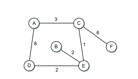

# Study Guide: Computer Networking Chapter 3


### Required reading
Sections: 3.1, 3.2 (except 3.2.2), 3.3, and 3.4

## Switching Basics

### Questions:
1. What is switching in computer networking?

   Switching in computer networking refers to the process of forwarding data from one device to another within a network. It is a fundamental function that allows data to be efficiently routed through the network, ensuring that it reaches its intended destination. Switching can occur at various network layers, such as data link layer (Layer 2) or network layer (Layer 3), and it plays a critical role in the operation of local area networks (LANs) and wide area networks (WANs).

2. Explain the difference between circuit switching and packet switching.

    In circuit switching, a dedicated communication path or circuit is established for the duration of a conversation or data transmission. This means that the entire bandwidth is reserved for the communication, even if no data is being sent. Traditional telephone networks are an example of circuit-switched networks.

    Packet switching breaks data into small packets, which are then independently routed through the network to their destination. Each packet can take a different path, and they are reassembled at the destination. The Internet is a prime example of a packet-switched network, where data is divided into packets and sent separately.

3. What are the advantages of packet switching over circuit switching?

    Efficient Use of Network Resources: Packet switching allows for more efficient utilization of network bandwidth because it only uses resources when there is actual data to send. In circuit switching, bandwidth remains reserved, even during periods of silence.

    Scalability: Packet switching networks can accommodate a larger number of users and devices because they share the available bandwidth. Circuit-switched networks are limited by the number of available circuits.

    Resilience: Packet switching can adapt to network failures or congestion by finding alternative routes for packets, enhancing network resilience.

    Multiplexing: Packet switching supports multiplexing, allowing multiple data streams to share the same network.

4. What is a switch? How does it differ from a hub?

    A network switch operates at the data link layer (Layer 2) of the OSI model and is a more intelligent device compared to a hub. It uses MAC addresses to make forwarding decisions and can create separate collision domains for each port, which improves network performance. Switches are more efficient because they only forward data to the specific port where the destination device is located.

   A network hub operates at the physical layer (Layer 1) and simply broadcasts incoming data to all connected devices. Hubs do not have the intelligence to make forwarding decisions based on MAC addresses, and they do not create separate collision domains. This leads to more collisions and reduced network performance.

5. Describe the process of switching a packet within a switch.

    When a packet arrives at a network switch, the switch examines the destination MAC address in the Ethernet frame header.
    It looks up its internal MAC address table (also known as a CAM table) to determine which port is associated with the destination MAC address.
    The switch then forwards the packet only to the port where the destination device is located, effectively isolating the traffic to the necessary segment of the network.

6. What is store-and-forward switching? How does it ensure data integrity?

    Store-and-forward switching is a method used by many network switches. When a switch receives a packet, it temporarily stores the entire packet in a buffer before forwarding it. This process ensures that the packet is error-free and complete before being forwarded.

    Data integrity is maintained because the switch performs a CRC (Cyclic Redundancy Check) on the packet to detect any transmission errors. If the packet is corrupt, it is discarded, preventing the propagation of errors in the network.

    Once the switch confirms the integrity of the packet, it forwards it to the destination port, enhancing the reliability of data transmission in the network.


### Exercises:
1. Compare and contrast the performance characteristics of circuit switching and packet switching.
    Circuit switching establishes a dedicated communication path between the source and destination for the entire duration of the communication. Also the resources (bandwidth, nodes) are reserved for the entire duration of the communication, even if no data is being transmitted. On the other hand the delay is predictable and consistent.
    Meanwhile Packet switching breaks data into packets, which are sent independently over the network. Each packet may take a different route to reach the destination.The resources are used on-demand, and the network can handle multiple connections simultaneously.Since packets can take different routes, the delay is variable. However, advancements like Quality of Service (QoS) can be implemented to manage delay.
    Variable Bandwidth: Bandwidth is shared among multiple users, and it can vary based on network conditions.


2. Research and list three different types of switches commonly used in computer networks.

    1- Ethernet Switch: Connects devices within a local area network (LAN) and uses MAC addresses to forward data to the 

    2- Router: Connects different networks and makes decisions about where to send data based on IP addresses.

    3- Layer 3 Switch: Combines features of a switch and a router, making forwarding decisions based on both MAC addresses (like a switch) and IP addresses (like a router).


3. Design a simple network topology using switches to connect multiple computers. Label the switches and computers in your diagram.


## Switched Ethernet

### Questions:
1. What is Ethernet? How does it work?

    Ethernet is a widely used networking technology that defines the rules and specifications for connecting devices within a local area network (LAN). It operates at the data link layer (Layer 2) of the OSI model and is the most common LAN technology. Ethernet uses a system of frame-based communication to send data between devices in a network.
    
    Here's how Ethernet works:

    Devices on an Ethernet network are connected to a shared medium, such as Ethernet cables or wireless connections.

    Each device on the network has a unique Media Access Control (MAC) address, which is a hardware address assigned to the network interface card (NIC).

    When a device wants to send data to another device, it encapsulates the data into an Ethernet frame. This frame includes the source MAC address, the destination MAC address, and the data payload.

    The Ethernet frame is then transmitted onto the network medium, and all devices connected to that medium receive the frame.

    Each device on the network examines the destination MAC address in the frame. If the address matches the device's own MAC address, it processes the frame; otherwise, it disregards it.

    Ethernet uses a CSMA/CD (Carrier Sense Multiple Access with Collision Detection) protocol to handle collisions, which is the process of multiple devices trying to transmit data on the network simultaneously.

2. Explain the concept of a collision domain in Ethernet.

    A collision domain is a segment of a network where collisions can occur when two or more devices attempt to transmit data simultaneously. Collisions can lead to data corruption and decreased network performance.
    In traditional Ethernet networks (e.g., using hubs), the entire network segment is a single collision domain. When two devices transmit data at the same time, a collision occurs, and both devices have to retransmit their data after a random backoff period.
    Switches, on the other hand, create separate collision domains for each port. This means that collisions are limited to the devices connected to a specific port, improving network efficiency and reducing the chances of collisions.

3. What are learning bridges?

    Learning bridges, also known as Ethernet bridges or switches, are devices used to connect and segment Ethernet networks. These devices operate at the data link layer (Layer 2) of the OSI model.
    Learning bridges work by maintaining a MAC address table (often called a CAM table) that maps MAC addresses to the corresponding physical ports. When a frame arrives at the bridge, it examines the source MAC address and updates the MAC address table with the source MAC address and the port through which the frame arrived.
    Learning bridges use this MAC address table to make forwarding decisions. When a frame with a destination MAC address is received, the bridge looks up the address in its table to determine which port to forward the frame to. This helps reduce network traffic by only forwarding frames to the necessary segments of the network.

4. Explain the Spanning Tree Algorithm

    The Spanning Tree Algorithm (STA) is a network protocol used to prevent loops in Ethernet networks. Loops can cause broadcast storms and negatively impact network performance. The most common implementation of STA is the IEEE 802.1D standard.
    STA works by designating one switch in the network as the "root bridge" and then systematically disabling certain ports on switches to create a loop-free topology. The algorithm ensures that there is only one path between any two devices in the network, preventing loops from forming.
    STA continually monitors the network for changes and, if necessary, recalculates the spanning tree to adapt to network topology changes.

5. What are VLANs?

    VLANs are a method of segmenting a single physical network into multiple logical networks. This segmentation is achieved by grouping devices into virtual LANs based on factors like department, function, or team, rather than their physical location.
    VLANs allow network administrators to control and manage network traffic more effectively, improve security, and reduce broadcast domains.
    Devices in the same VLAN can communicate with each other as if they were on the same physical network, even if they are located in different physical locations. Devices in different VLANs typically require a router to facilitate communication between them.
    VLANs are commonly used in larger networks to enhance network organization and security.


## Internet (IP)

### Questions:
1. What is the Internet Protocol (IP)? How does it work?

    The Internet Protocol (IP) is a set of rules and conventions that govern how data packets are transmitted, routed, and received over the Internet and other networks. It is a fundamental protocol in the Internet's layered architecture and is responsible for addressing and routing data packets between devices on different networks.
    IP works in conjunction with other protocols to provide end-to-end communication between devices, allowing data to traverse multiple networks and routers to reach its intended destination.

2. Explain the difference between IPv4 and IPv6.

    IPv4 (Internet Protocol version 4): IPv4 is the most widely used IP version. It uses 32-bit addresses, typically written as four decimal numbers separated by periods (e.g., 192.168.1.1). IPv4 has a limited address space, which has led to address exhaustion issues.
    IPv6 (Internet Protocol version 6): IPv6 was developed to address the IPv4 address exhaustion problem. It uses 128-bit addresses, written as eight groups of hexadecimal digits separated by colons (e.g., 2001:0db8:85a3:0000:0000:8a2e:0370:7334). IPv6 offers a vastly larger address space and improved features for security and network autoconfiguration.

3. What is an IP address? How is it structured?

    An IP address is a numerical label assigned to each device connected to an IP network, such as the Internet or a local network. IP addresses serve two primary functions: identifying the host or network and providing a location for routing data packets.
    IPv4 addresses are structured as a series of four 8-bit octets, which are written in decimal form (e.g., 192.168.1.1). IPv6 addresses are represented as a series of 8 groups of 4 hexadecimal digits (e.g., 2001:0db8:85a3:0000:0000:8a2e:0370:7334).

4. What is the purpose of subnetting in IP addressing?

    Subnetting is the process of dividing an IP network into smaller, more manageable subnetworks, known as subnets. It is done for several reasons, including optimizing network performance, improving security, and simplifying network management.
    Subnetting allows an organization to allocate IP addresses more efficiently by creating smaller address blocks for different segments of the network. Each subnet may be assigned to a specific department, location, or function, making it easier to manage and secure.

5. Describe the process of IP packet forwarding.

    IP packet forwarding is the process by which routers determine the next hop (next router or destination) for an IP packet based on the packet's destination IP address.
    When a router receives an IP packet, it looks at the destination IP address and consults its routing table to determine the appropriate output interface and next hop router.
    The router then forwards the packet to the next hop, and the process is repeated until the packet reaches its final destination.

6. What is the role of the Internet Control Message Protocol (ICMP) in IP?

    ICMP is a network layer protocol that operates on top of the Internet Protocol. It is primarily used for reporting errors and providing diagnostic information about network conditions.
    ICMP is responsible for sending error messages (e.g., "ping" requests and responses) that help network administrators troubleshoot and diagnose network issues.
    ICMP also plays a role in network management, such as indicating unreachable hosts or network congestion. It is a crucial part of network troubleshooting and maintenance, allowing administrators to detect and respond to network problems.

### Exercises:
1. Convert the following IPv4 address to binary: 192.168.0.1.

    192.168.0.1 = 11000000.10101000.00000000.00000001

2. Research and list three different classes of IP addresses.

    Class A:

    Range: 1.0.0.0 to 126.255.255.255

    Leading bits: 0

    Default Subnet Mask: 255.0.0.0

    Class B:

    Range: 128.0.0.0 to 191.255.255.255

    Leading bits: 10

    Default Subnet Mask: 255.255.0.0

    Class C:

    Range: 192.0.0.0 to 223.255.255.255

    Leading bits: 110

    Default Subnet Mask: 255.255.255.0

3. Configure a computer to use a static IP address. Document the steps you followed.

- Open Network and Sharing Center:

    Go to the Control Panel.
    Click on "Network and Sharing Center."

- Change Adapter Settings:

    Click on "Change adapter settings" in the left sidebar.

- Open Adapter Properties:

    Right-click on the network adapter you are using and select "Properties."

- Select Internet Protocol Version 4 (TCP/IPv4):

    In the list of items, find "Internet Protocol Version 4 (TCP/IPv4)" and select it.
    Click the "Properties" button.

- Configure IP Address:

    Choose the option "Use the following IP address."
    Enter the desired IP address, subnet mask, and default gateway.
    You may also enter DNS server addresses if necessary.
- Apply Changes:


## Routing

### Questions:
1. What is routing in computer networking?

    Routing is the process of determining the most efficient path for data packets to travel from a source to a destination within a network. It involves making decisions based on network topology, addressing, and routing protocols to ensure that data packets reach their intended destinations while minimizing delays and congestion.

2. Explain the difference between static routing and dynamic routing.

    Static Routing: In static routing, network administrators manually configure routing tables on routers to determine the path that data packets should take. These routes do not change unless manually updated. Static routing is suitable for small networks with predictable traffic patterns.

    Dynamic Routing: Dynamic routing, on the other hand, relies on routing protocols to automatically adjust routing tables based on network conditions. Routers exchange information with one another to determine the best path for data packets. Dynamic routing is more scalable and adaptable to changes in network topology and traffic loads.

3. What is a routing table? How is it used in the routing process?

    A routing table is a data structure that routers use to make forwarding decisions. It contains information about the available network paths, including the destination IP addresses, associated next-hop routers, and the corresponding interfaces. Each router has its own routing table.
    When a router receives an IP packet, it examines the destination IP address and looks up this address in its routing table to determine where to forward the packet. The router will select the entry that best matches the destination address based on the longest prefix match.

4. What is the purpose of a default gateway in routing?

    A default gateway is the router to which a device sends all outbound traffic if there is no specific route in its routing table for the destination address. It is typically used by devices within a local network to access destinations outside of the local network, such as the Internet.
    The default gateway is usually configured on the network settings of a device, and it points to the IP address of the router that serves as the exit point from the local network. The router, in turn, is responsible for routing traffic to external destinations.

5. Describe the process of routing a packet from source to destination.

    When a device (e.g., a computer) wants to send a packet to a destination, it checks its own routing table to determine if it knows the appropriate route. If the destination is within the local network, the device can forward the packet directly to the destination device using the local network segment.
    If the destination is outside the local network, the device sends the packet to its default gateway (usually the local router). The router, upon receiving the packet, checks its own routing table to determine the next-hop router that can reach the destination.
    This process is repeated as the packet traverses routers along the path to its final destination. Each router checks its routing table, makes decisions on how to forward the packet to the next hop, and the packet moves closer to the destination with each hop.
    The packet continues to be routed through intermediary routers until it reaches the final destination network. The destination device then receives and processes the packet.
    
## Exercises



1. For the network given in figure above, show how the link-state algorithm builds the routing table for node D.
   


```python

```
