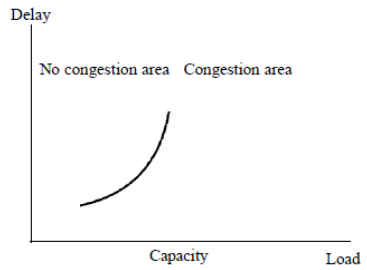
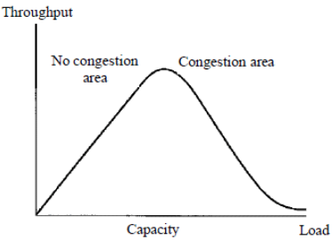

# Study Guide: Computer Networking Chapter 5 and Chapter 6

### Required reading
Sections: 5.1, 5.2, 6.1, 6.2, and 6.3

## Computer Networking Study Guide

### End-to-End Protocols

1. What is the purpose of end-to-end protocols in computer networking?

    End-to-end protocols in computer networking are designed to ensure reliable communication between two devices or systems. The purpose is provide a reliable transfer of data from the source to the destination.

2. Explain the difference between connection-oriented and connectionless protocols.

    In connection-Oriented Protocols like TCP (Transmission Control Protocol), it establishes a connection before data transfer. Which provides reliable, ordered, and error-checked delivery of data. while in connectionless protocols like UDP (User Datagram Protocol) there is no prior connection establishment, each packet is sent independently. Also is faster, as there is less overhead without connection setup. But it does not guarantee reliable delivery.

3. What are the advantages and disadvantages of using end-to-end protocols?

    Advantages:

    Ensures reliable and ordered delivery of data, handles error detection and correction. So it is suitable for applications that require high reliability, such as file transfers.

    Disadvantages:

    Increased overhead due to connection setup and maintenance.
    May introduce latency, especially in situations where quick data transmission is essential.

4. How does the Internet Protocol (IP) provide end-to-end delivery?

    IP is responsible for routing packets between devices in a network. While IP itself doesn't guarantee end-to-end delivery or reliability, it forms the basis for higher-layer protocols like TCP or UDP. TCP is used in conjunction with IP, it provides reliable, connection-oriented communication, ensuring end-to-end delivery.

5. What is the role of the Transport Layer in end-to-end protocols?

    The transport layer is represented by protocols such as TCP and UDP. First the TCP (Transmission Control Protocol) establishes a connection between two devices before data transfer. Then divides the data into segments, adds sequence numbers for the requested delivery, and includes error checking information. This provides flow control and retransmission of lost or corrupted segments.

    On the other hand, UDP (User Datagram Protocol) is connectionless and does not establish a connection before data transfer. It is simple and lightweight, suitable for applications where low overhead is more critical than reliability.

### UDP

1. What is UDP and how does it differ from TCP?

    UDP is a transport layer protocol that operates on top of the Internet Protocol (IP). This protocol is connectionless, becuase it does not establish a connection before sending data and does not guarantee the delivery of data.

    It differ from TCP becuase is simpler and faster comparing to TCP, also it is suitable for applications where low overhead and quick transmission are more critical than reliability.

2. Explain the advantages and disadvantages of using UDP.

    The advantages of using UDP are that it has less overhead than TCP since it lacks connection setup and maintenance mechanisms. Additionally, the absence of handshake and retransmission processes makes UDP faster than TCP. Therefore, applications that require low latency, such as online gaming, live streaming, and VoIP, benefit from UDP.

    The disadvantages are that UDP does not guarantee the delivery of data, so some packets may be lost without notification. Also the packets may arrive out of order, and applications must handle reordering if necessary.

3. How does UDP handle error detection and correction?

    UDP does not provide mechanisms for error detection or correction. So any error detection or correction must be implemented at the application layer if required. For that, some applications using UDP may incorporate their error-checking mechanisms based on the specific needs of the application.

4. What are some common applications that use UDP?

    UDP is commonly used in real-time applications where low latency is crucial, such as online gaming, voice over IP applications, video streaming and conferencing.
    
    DNS queries and responses often use UDP for their simplicity and speed.

    DHCP uses UDP for communication between clients and servers for obtaining IP addresses.

5. Discuss the role of ports in UDP communication.

    Ports are used to differentiate between different services or processes on a device.

    In UDP communication, each UDP packet contains source and destination port numbers. the combination of the source IP address, source port, destination IP address, and destination port uniquely identifies a UDP communication endpoint.

    Ports help direct incoming data to the appropriate application or service on the receiving device.

### TCP

1. What is TCP and why is it considered a reliable protocol?

    TCP is connection-oriented, meaning it establishes a connection before transferring data, and it uses acknowledgments and retransmissions to ensure reliable communication.

    TCP is considered a reliable protocol because it provides mechanisms for establishing a connection, ensuring the ordered and reliable delivery of data, and handling error detection and correction.

2. Explain the three-way handshake process used by TCP to establish a connection.

   - SYN (Synchronize): The client sends a SYN packet to the server, indicating its intention to establish a connection and initiating a sequence number.

    - SYN-ACK (Synchronize-Acknowledge): The server responds with a SYN-ACK packet, acknowledging the client's request and sending its own sequence number.

    - ACK (Acknowledge): The client sends an ACK packet back to the server, confirming the receipt of the server's acknowledgment. At this point, the connection is established.

3. How does TCP handle flow control and congestion control?

    TCP uses a sliding window mechanism for flow control. The receiver advertises a window size to the sender, indicating the amount of data it can accept. This helps prevent the sender from overwhelming the receiver with data.
    
    TCP employs congestion control mechanisms to avoid network congestion. It dynamically adjusts the transmission rate based on the perceived network conditions, utilizing algorithms like slow start and congestion avoidance.

4. Discuss the advantages and disadvantages of using TCP.

    The advantages are that TCP ensures reliable and ordered delivery of data through mechanisms like acknowledgment and retransmission. Also TCP includes error-checking mechanisms to detect and correct errors in transmitted data. Moreover, it prevents congestion and controls the flow of data to ensure efficient communication.

    The disadvantages are that the connection setup and maintenance processes in TCP introduce higher overhead compared to UDP. Also, due to the additional reliability mechanisms, TCP can be slower than UDP, making it less suitable for real-time applications with low latency requirements.

5. What are some common applications that rely on TCP for communication?

    - World Wide Web (HTTP): The Hypertext Transfer Protocol (HTTP), used for web browsing, relies on TCP for reliable communication.
    - Email : Email protocols such as SMTP, POP3, and IMAP use TCP.
    - File Transfer: The File Transfer Protocol uses TCP for transferring files between clients and servers.
    - Remote Terminal Access: Secure Shell and Telnet use TCP for providing remote terminal access.

### Congestion Control

1. What is congestion control and why is it important in computer networks?

    Congestion control is a mechanism used in computer networks to regulate the flow of data and prevent congestion, which occurs when the demand for network resources exceeds its capacity. It is important because congestion can lead to degraded network performance, increased delays, packet loss, and, in extreme cases, network collapse. 

2. Discuss the various congestion control algorithms used in TCP.

    Slow Start: TCP begins by sending a small number of packets and doubles the sending rate after each acknowledgment until a congestion event occurs.

    Congestion Avoidance: After reaching a certain threshold, TCP transitions from the slow start phase to congestion avoidance, increasing the sending rate more gradually to prevent abrupt congestion.

    Fast Retransmit and Fast Recovery: When TCP detects packet loss, it can quickly retransmit the lost packet without waiting for a timeout. 

    TCP SACK (Selective Acknowledgment): Allows the receiver to acknowledge out-of-order segments, enabling more precise retransmission during congestion.

3. How does TCP react to congestion in the network?

    When TCP detects congestion, it takes several steps to mitigate the impact. First it start reducing the congestion window to decrease the sending rate. Then, it initiating the slow start phase to gradually increase the sending rate. 

4. What are some techniques used to measure and detect network congestion?

    Packet Loss: Increased packet loss is a strong indicator of network congestion.

    Round-Trip Time (RTT): An abrupt increase in RTT can suggest congestion in the network.

    Queue Length: Monitoring the length of network queues can provide insights into congestion levels.

    Router and Switch Statistics: Analyzing statistics on routers and switches, such as dropped packets and buffer utilization, can indicate congestion.

    End-to-End Delay: A sudden increase in end-to-end delay may signify network congestion.

    Explicit Congestion Notification (ECN): Network devices and routers can mark packets to notify endpoints of congestion, allowing for proactive congestion avoidance.

### TCP and Sliding Window

1. What is the sliding window protocol and how does it improve the efficiency of data transmission?

    The sliding window protocol is a communication protocol that enhances the efficiency of data transmission between two devices by allowing multiple packets to be in transit simultaneously. It improves efficiency by enabling the sender to transmit multiple packets before waiting for acknowledgments, thereby utilizing available bandwidth more effectively.

2. Explain the concept of window size in TCP and its impact on network performance.

    The window size in TCP represents the number of unacknowledged packets that can be sent by the sender before requiring an acknowledgment. A larger window size allows for more packets in transit, increasing the potential throughput and efficiency of the data transfer. The window size is dynamically adjusted during the course of communication based on network conditions and congestion.

3. How does TCP handle acknowledgments and retransmissions using the sliding window protocol?

    The receiver sends acknowledgments (ACKs) to the sender to confirm the successful receipt of packets. If the sender does not receive an acknowledgment within a specified time (timeout), or if it receives a duplicate acknowledgment (indicating packet loss), it retransmits the unacknowledged packets.

    The sliding window protocol allows the sender to keep a "window" of unacknowledged packets, and as acknowledgments are received, the window slides forward, allowing the sender to send new packets.

4. Discuss the advantages and disadvantages of using the sliding window protocol.

    Advantages:

    The ability to transmit multiple packets before waiting for acknowledgments maximizes network utilization and throughput. It minimizes the impact of round-trip time by maintaining a continuous stream of data and the window size can be dynamically adjusted to respond to network conditions.

    Disadvantages:

    Implementation can be more complex compared to simpler protocols. There is some overhead associated with maintaining the sliding window and handling acknowledgments and larger window sizes may require larger buffers to store unacknowledged data.

5. What are some techniques used to optimize the sliding window protocol?

    - Selective Repeat: A variation of the sliding window protocol where only the missing or damaged packets are retransmitted, reducing unnecessary retransmissions.
  
    - TCP SACK (Selective Acknowledgment): Allows the receiver to acknowledge out-of-order packets, improving the efficiency of retransmissions.

    - Dynamic Window Sizing: Dynamically adjusting the window size based on network conditions, avoiding underutilization or overload.

    - Window Scaling: Increasing the effective window size beyond the limitations of the protocol to support high-bandwidth networks.

## Exercises

1. Consider a simple UDP-based protocol for requesting files (based somewhat loosely on the Trivial File Transport Protocol, or TFTP). The client sends an initial file request, and the server answers (if the file can be sent) with the first data packet. Client and server then continue with a stop-and-wait transmission mechanism.

    (a) Describe a scenario by which a client might request one file but get another; you may allow the client application to exit abruptly and be restarted with the same port.

    In the following scenario, a client receives file “foo” when it thinks it has requested “bar”.
    1. The client sends a request for file “foo”, and immediately aborts locally. The request, however, arrives at the server.
    2. The client sends a new request, for file “bar”.
    3. The server responds with first data packet of “foo”, answering the only request it has actually seen.

    (b) Propose a change in the protocol that will make this situation much less likely.

    Requiring the client to use a new port number for each separate request would solve the problem. To do this, the client would have to trust the underlying operating system to assign a new port number each time a new socket was opened. Having the client attach a timestamp or random number to the file request, to be echoed back in each data packet from the server, would be another approach fully under the application’s control

2. The sequence number field in the TCP header is 32 bits long, which is big enough to cover over 4 billion bytes of data. Even if this many bytes were never transferred over a single connection, why might the sequence number still wrap around from 232 − 1 to 0?

    There are two primary reasons why the TCP sequence number might wrap around from 232 - 1 to 0: Efficiency and Handling lost packets. Also, the sequence number doesn’t always begin at 0 for a transfer, but is randomly or clock generated.

3. The Nagle algorithm, built into most TCP implementations, requires the sender to hold a partial segment’s worth of data (even if PUSHed) until either a full segment accumulates or the most recent outstanding ACK arrives.
    
    (a) Suppose the letters abcdefghi are sent, one per second, over a TCP connection with an RTT of 4.1 seconds. Draw a timeline indicating when each packet is sent and what it contains.

    T=0.0 ‘a’ sent
    T=1.0 ‘b’ collected in buffer
    T=2.0 ‘c’ collected in buffer
    T=3.0 ‘d’ collected in buffer
    T=4.0 ‘e’ collected in buffer
    T=4.1 ACK of ‘a’ arrives, “bcde” sent
    T=5.0 ‘f’ collected in buffer
    T=6.0 ‘g’ collected in buffer
    T=7.0 ‘h’ collected in buffer
    T=8.0 ‘i’ collected in buffer
    T=8.2 ACK arrives “bcde” “fghi” sent
    
    (b) If the above were typed over a full-duplex Telnet connection, what would the user see?

    The user would see the characters appear one at a time, with a delay of 4.1 seconds between each character. This is because the Nagle algorithm delays sending single characters until an ACK is received for the previous packet or the maximum segment size is reached.

    (c) Suppose that mouse position changes are being sent over the connection. Assuming that multiple position changes are sent each RTT, how would a user perceive the mouse motion with and without the Nagle algorithm?

    Without Nagle the user would experience a smooth and responsive mouse movement due to the following reasons:

    Multiple position changes are sent within each RTT, providing frequent updates to the server.

    The lack of Nagle delay ensures immediate transmission of each position update, minimizing the time between user action and corresponding movement on screen.

    With Nagle the user might experience a choppy and unresponsive mouse movement due to the following reasons:

    Nagle delays sending updates until an ACK is received or the maximum segment size is reached, causing noticeable gaps in the flow of position data.

    This delay can be especially noticeable when multiple small position changes occur within a single RTT, as Nagle would only send them in one larger packet after a delay.

4. Suppose two hosts A and B are connected via a router R. The A–R link has infinite bandwidth; the R–B link can send one packet per second. R’s queue is infinite. Load is to be measured as the number of packets per second sent from A to B. Sketch the throughput-versus-load and delay-versus-load graphs, or if a graph cannot be drawn, explain why. Would another way to measure load be more appropriate?

    
    
    
    Another way to measure load might be in terms of the percentage of time the peak rate exceeds 1, assuming that the average rate remains less than 1.

5. Suppose that between A and B there is a router R. The A–R bandwidth is infinite (that is, packets are not delayed), but the R–B link introduces a bandwidth delay of 1 packet per second (that is, 2 packets take 2 seconds, etc.). Acknowledgments from B to R, though, are sent instantaneously. A sends data to B over a TCP connection, using slow start but with an arbitrarily large window size. R has a queue size of one, in addition to the packet it is sending. At each second, the sender first processes any arriving ACKs and then responds to any timeouts.

    (a) Assuming a fixed TimeOut period of 2 seconds, what is sent and received for T = 0, 1, . . . , 6 seconds? Is the link ever idle due to timeouts?

    T = 0:

    - A sends 1 packet (packet 1).
    - R receives packet 1 and instantly sends an acknowledgment (ACK 1) to B.
    - B receives ACK 1 and instantly sends an acknowledgment (ACK 1) to R.
    - A receives ACK 1 and infers successful transmission.
    T=1:

    A sends 2 packets (packets 2 and 3) due to slow start.
    R receives packet 2 and starts sending it to B.
    B receives ACK 1 from R.
    A receives no acknowledgment yet.

    T = 2:

    - R finishes sending packet 2 to B.
    - B receives packet 2.
    - R starts sending packet 3 to B.
    - B sends an acknowledgment (ACK 2) for packet 2 to R.
    - A receives ACK 2 and infers successful transmission of packet 1.
    - A sends 4 packets (packets 4 to 7) due to slow start.
    
    T = 3:

    - R finishes sending packet 3 to B.
    - B receives packet 3.
    - R starts sending packet 4 to B.
    - B sends an acknowledgment (ACK 3) for packet 3 to R.
    - A receives ACK 3 and infers successful transmission of packet 2.
  
    T = 4:
    - R finishes sending packet 4 to B.
    - B receives packet 4.
    - R starts sending packet 5 to B.
    - B sends an acknowledgment (ACK 4) for packet 4 to R.
    - A receives ACK 4 and infers successful transmission of packet 3.
    - A has sent 7 packets and received acknowledgments for 3.
    
    T = 5:

    - R finishes sending packet 5 to B.
    - B receives packet 5.
    - R starts sending packet 6 to B.
    - B sends an acknowledgment (ACK 5) for packet 5 to R.
    - A receives ACK 5 and infers successful transmission of packet 4.
    
    T = 6:

    - R finishes sending packet 6 to B.
    - B receives packet 6.
    - B has received all packets (1-6) and sends an acknowledgment (ACK 6) for the last packet.
    - A receives ACK 6 and infers successful transmission of packet 5.

    (b) What changes if TimeOut is 3 seconds instead?

    With TimeOut = 3 sec, we will have slower initial transmission, increased risk of timeouts, later congestion window growth, reduced sensitivity to delays and potential for larger idle periods.
